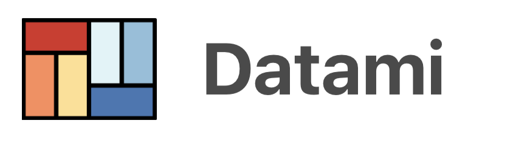

<!--  -->

---
<!-- #  DATAMI -->
**Contribute easily to data stored with git**
_but without having to use Github or Gitlab interfaces_

---

## Summary

- [What is Datami for ?](#what-is-datami-for-)
- [Websites](#websites-)
- [Documentation](#documentation-)
- [Project setup](#project-setup-)
- [Stack](#stack-)

---

## What is Datami for ? [⇡](#summary)

This project aims to create a serie of widgets to interact with ressources stored on Gitlab, Github, or mediawiki :

- **Edit data stored on github or gitlab** (`csv`, `md`, or `json` files) ;
- **Allow unidentified users to push on a separate branch** and automatically create a pull request ;
- **Create a set of components for modular uses** :
  - preview for `.csv`, `.md`, `.json` files or `mediawiki` ressources, with several choices for preview (table, cards list, ...) ;
  - files edition interfaces ;
  - dataviz for `.csv` files (barcharts, pies, ...) ;
  - user preferences: language, user token, ...
  - etc...
- **Web integration as modular web component**

---

## Websites [⇡](#summary)

- Official website : [datami.multi.coop](https://datami.multi.coop/)

### Prod deploy &nbsp; [](https://app.netlify.com/sites/datami-widget/deploys)

- Website (widgets demo) : [datami-widget.multi.coop](https://datami-widget.multi.coop/)

### Preprod deploy

- Preprod : [Datami (preprod on Netlify)](https://preprod--datami-widget.netlify.app/)

---

## Documentation [⇡](#summary)

Check out our brand new documentation website for technical support :

- Documentation website : [datami-docs.multi.coop](https://datami-docs.multi.coop)

---

## Project setup [⇡](#summary)

The current project is working with `npm 8.3.2` version

To install it, use the command :

```bash
npm install -g npm@8.3.2
```

Then you can install the dependancies and add a dummy `.env` file based on the example.

```bash
nvm use
npm install

# and copy the example .env file
cp example.env .env
```

### Compiles and hot-reloads for development

To run locally Datami you just have to type :

```bash
npm run serve
```

### Compiles and minifies for production

```bash
npm run build
```

### Run your unit tests

```bash
npm run test:unit
```

### Lints and fixes files

```bash
npm run lint
```

### Customize configuration

See [Configuration Reference](https://cli.vuejs.org/config/).

---

# Stack [⇡](#summary)

We only used open source packages and technologies, coz' that's what we do... :

- [`Vue.js` (2.x)](https://v2.vuejs.org/v2/guide) : yes we like this framework a lot...
- [`VueX`](https://vuex.vuejs.org/): the data store shared for every web component ;
- [`vue-custom-element`](https://github.com/karol-f/vue-custom-element): wrapper for vue web components ;
- [`gray-matter`](https://www.npmjs.com/package/gray-matter): package to convert `md` or `yaml` content to object ;
- [`Showdown`](https://www.npmjs.com/package/showdown) and [`showdown-table` extension](https://github.com/showdownjs/table-extension#readme): package to convert `md` content to `html` (see [docs for showdown extensions](https://github.com/showdownjs/showdown#extensions));
- [`Bulma`](https://bulma.io/) and [`Buefy`](https://buefy.org/) : as UI frameworks for vue ;
- [`Material Design`](https://materialdesignicons.com/) fonts: for icons ;
- [`Fetch`](https://developer.mozilla.org/en-US/docs/Web/API/Fetch_API/Using_Fetch): for requests to Github's or Gitlab's API ;
- [`JSDiff`](https://github.com/kpdecker/jsdiff) : to get diff between an original content and its edited version
- [`Diff2html`](https://www.npmjs.com/package/diff2html) : to display diff like in github / gitlab
- [`MapLibre`](https://maplibre.org) : the open and free fork from MapboxGl.js to make maps
- [`ApexCharts`](https://apexcharts.com) : an open library to make charts
- ...and a lot of Stackoverflow help...

---

Datami is an open source project by the tech cooperative **[multi](https://multi.coop)**
