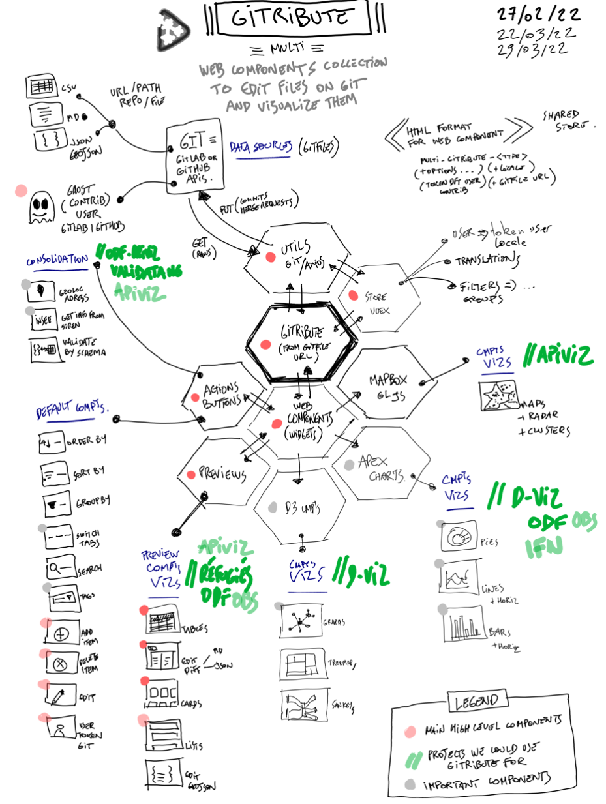

<!--  -->

---
<!-- # Gitribute -->
**Contribute easily with git** (but without having to use Github or Gitlab)

---

This project aims to create a serie of widgets to interact with Gitlab or Github :

- **Edit data stored on github or gitlab** (csv or md files) ;
- **Allow unidentified users to push on a separate branch** and automatically create a pull request ;
- **Create a set of components for modular uses** :
  - preview for `.csv`, `.md`, `.json` files, with several choices for preview (table, cards list, ...) ;
  - files edition ;
  - dataviz for `.csv` files (barcharts, pies, ...) ;
  - etc...
- **Web integration as modualr web component**

---

## Work in progress... be patient guys (or help us by contributing) :)

This project is currently under early development...

The **roadmap** for a first proof of concept (POC) is the following :

- [x] Skeleton for `vue-custom-element` / `vuejs` : vuex, dependencies, linting, ... ;
- [x] First utils functions and mixins to process a file's gitlab/github url ;
  - [x] Get all git infos from file's url ;
  - [x] Get file's raw data from provider ;
  - [x] Format file's raw data to expected structures (from `md` or `csv` to objects) ;
- [x] Install a CSS framework for Vuejs ( Bulma / Buefy / Vuetify... ? ) ;
- [x] Prepare a simple multi-language / translation solution ;
- [x] Create the first main components :
  - [ ] For each file type create a loading skeleton while waiting raw file to load ;
  - [x] Preview for a `.md` file ;
  - [x] Preview for a `.csv` file ;
  - [ ] Preview for a `.json` or `.geojson` file ;
  - [ ] Component to update user's token (if user has a specific one for direct commits) ;
  - [ ] Component to switch between french and english ;
- [x] Create a "ghost user" on gitlab and github for test purposes, acting as anonymous gitlab/github users (with their token, injected in web component) ;
- [ ] `PUT` functions to update file stored on gitlab/github ;
- [ ] Other main components :
  - [ ] On each preview (for every file type), switch between preview and edition view ;
  - [ ]  Add a `Save` button + dialog + actions : after edition on client's side, acting as a commit to the file's git repo on a separate branch + merge request (commit and request by default done the "ghost user") ;
- [ ] Deploy on Netlify for test purposes.

... and just for a POC, that's would be greaaaaat ...

---

An open source project by **[multi](https://multi.coop)**

---

## Project setup

```bash
nvm use
npm install
```

### Compiles and hot-reloads for development

```bash
npm run serve
```

### Compiles and minifies for production

```bash
npm run build
```

### Run your unit tests

```bash
npm run test:unit
```

### Lints and fixes files

```bash
npm run lint
```

### Customize configuration

See [Configuration Reference](https://cli.vuejs.org/config/).

---

## How to integrate widgets

### CURRENTLY UNDER EARLY DEVELOPMENT - not deployed yet on netlify

Widgets need two files in order to work :

- `app.js`
- `app.css`

Add those two files to your html head, like this if the widget code is deployed on `https://multi-gitribute-test.netlify.app`:

```html
<script src="https://multi-gitribute-test.netlify.app/js/app.js" type="text/javascript"></script>

<link type="text/css" href="ttps://multi-gitribute-test.netlify.app/js/app.css" rel="stylesheet">
```

Widgets can then be called directly into the page as custom html elements.

---

# Widgets configuration

We plan to develop several widgets, all able to interact but also being able to be used independently.

---

## 1. `<multi-gitribute-file>`

The first widget's tag is : `<multi-gitribute-file/>`

This widget allows to preview and edit a file stored on Gitlab or Github.

The widget takes several parameters, following this structure :

```html
  <!-- Example for loading a distant .md file -->
  <multi-gitribute-file 
    locale="fr"
    gitfile="https://gitlab.com/multi-coop/gitribute-content-test/-/blob/main/texts/jailbreak-devient-multi-fr.md"
    msg="gitribute for gitlab file" 
    usertoken="MY-USER-TOKEN or GHOST-USER-TOKEN"
    locale="fr"
  ></multi-gitribute-file>
```

```html
  <!-- Example for loading a distant .csv file -->
  <multi-gitribute-file
    gitfile="https://github.com/multi-coop/gitribute-content-test/blob/main/data/csv/test-table-comma.csv" 
    options='{
      "separator":",",
      "abstractHeaders":"true"
    }' 
    msg="gitribute for gitlab file - csv (comma separator)" 
    usertoken="MY-USER-TOKEN or GHOST-USER-TOKEN"
    locale="en"
    debug="false"
  ></multi-gitribute-file>
```

### Options

This widget can take several parameters, some of them depends on your input file's type (`csv`, `json`, `md`, ...)

#### All file types

```yaml
gitfile:
  - description : the URL of a file stored on Gitlab or Github
  - type: string
  - required: true
  - note: |
    if you know the adress of a file on Github or Gitlab, 
    just copy-paste the url from your browser
```

```yaml
msg:
  - description : the message you want to display on top of the widget
  - type: string
  - required: false
  - default: null
```

```yaml
usertoken:
  - description : the user token allowing to commit / update a file on its repo
  - type: string
  - required: false
  - default: null
  - note: |
    If null, you can only read the file and not update it. 
    To be allowed to push on the file's repo you'll have at least 
    to create a ghost user acting as an anonymous contributor 
```

```yaml
locale:
  - description : the language you want to use by default
  - required: false
  - type: string
  - default: 'en'
  - allowed values: [ 'en', 'fr' ]
  - notes: |
    This parameter allows you to inject a locale component by componenet.
    But we'll have a selector to allow the user to apply a locale globally, overiding default injected locales.
```

```yaml
debug:
  - description : just for debugging
  - required: false
  - type: boolean
  - default: false
```

### For `md` files

```yaml
options:
  - (no options for now)
```

### For `json` files

```yaml
options:
  - (no options for now)
```

### For `csv` or `tsv` files

```yaml
options:
  - description : JSON object containing the options allowing your csv to be parsed correctly
  - required: false
  - default: {
      separator: ";", 
      abstractHeaders: "false"
    }
  - fields: 
    - separator: 
      description: character separating the columns in your csv source
      type: string
      allowed values: [ ",", ";", "|", "\t" ]
    - abstractHeaders:
      description: another way (quicker) to parse your csv and render it in a table
      type: boolean
    - tagseparator: 
      description: character separating a column's values into tags
      type: string
      allowed values: [ ",", ";", "|", "-", "_" ]
```

---

# Stack

We only used open source packages and technologies, coz' that's what we do... :

- [`Vue.js` (2.x)](https://v2.vuejs.org/v2/guide) : yes we like this framework a lot...
- [`VueX`](https://vuex.vuejs.org/): the store ;
- [`vue-custom-element`](https://github.com/karol-f/vue-custom-element): wrapper for vue web components ;
- [`gray-matter`](https://www.npmjs.com/package/gray-matter): package to convert `md` or `yaml` content to object ;
- [`Showdown`](https://www.npmjs.com/package/showdown) : package to convert `md` content to `html` ;
- [`Bulma`](https://bulma.io/) and [`Buefy`](https://buefy.org/) : as UI frameworks for vue ;
- [`Material Design`](https://materialdesignicons.com/) fonts: for icons ;
- [`Axios`](https://www.npmjs.com/package/axios): for requests to Github or Gitlab API ;
- and a lot of Stackoverflow...

---

# Schema

We are proud (and a bit ashamed too) to apply the `#passionSchema` to our brainstorming process...

<br>


